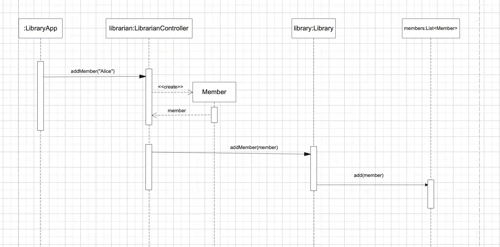
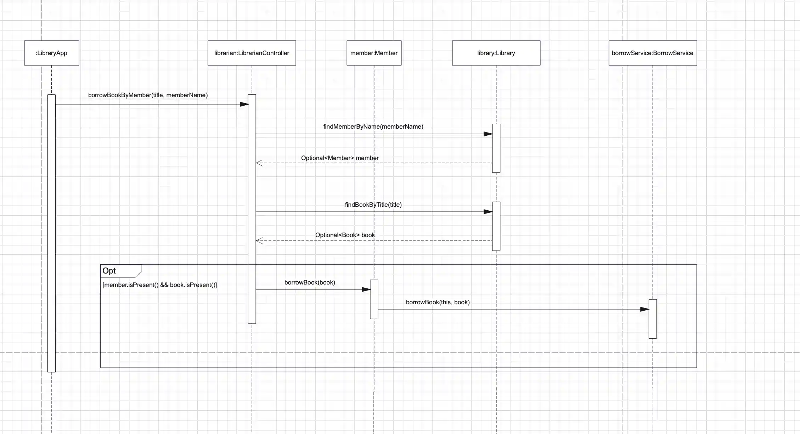
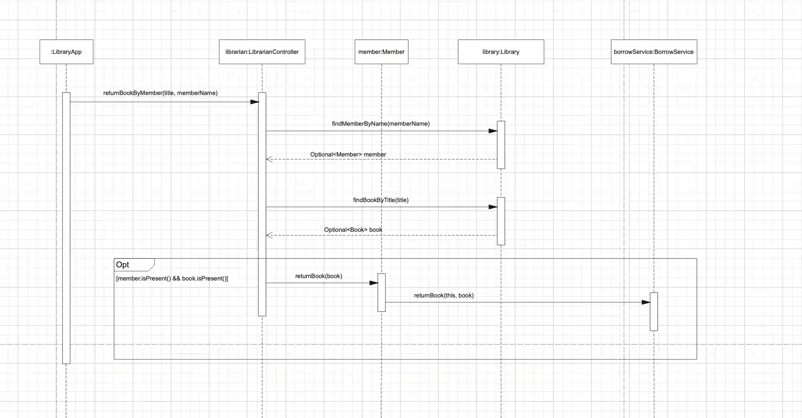

# COSC236 Lab 5 - Submitting Responses From Lab Document

**Student:** Maksym Spizhovyi  
**Student ID:** 300 362 869

 

## Part 1 - SEQUENCE DIAGRAMS

### ✅ addMember("Alice")
  
### ✅ borrowBookByMember("Dune", "Alice")
  
### ✅ returnBookByMember("Dune", "Alice")

 

## Part 2 - Rename the Book class to PaperBook

### ✅ Successfully done 

## Part 3 - (DIP) Dependency Inversion

### 1. Why did you introduce the Book interface?

The Book interface decouples high-level classes (Member, Library)
from specific implementations like PaperBook.  
This follows the Dependency Inversion Principle by depending
on abstractions rather than concrete classes.

### 2. How does this design improve flexibility?

Any book type (PaperBook, EBook, AudioBook) can now be used
interchangeably without modifying Member or Library.

### 3. How do your changes support the Open/Closed Principle?

Member and Library no longer need modification when new book types
are added. New classes simply implement Book.

### 4. What did you learn about using abstractions?

Abstractions reduce coupling, increase extensibility, and allow cleaner,
more testable object-oriented design.

 

## Part 4 - Other Book Types

### 1. Document changes made

- Added EBook and AudioBook classes implementing Book.
- Updated LibrarianController with **addPaperBook(), addEBook(), addAudioBook().**
- Updated tests to validate renting/returning all book types.

### 2. DIP Reflection

DIP allows adding _any_ rentable item by implementing Book:
rooms, laptops, DVDs, tools, etc.

#### What changes are needed?

Only new classes implementing Book.  
No changes to Member or Library.

### How would tests be modified?

Create new factory tests and rental/return tests for each new type.

### What if DIP was NOT applied?

Member would depend on concrete classes, requiring modifications
for every new type — violating OCP and making maintenance difficult.

 

# Part 5 - (SRP) Borrowing Service

Separating borrowing logic into BorrowingService ensures Member
only stores user data. BorrowingService manages:

- availability checks
- limit checks
- duplicate borrow checks

### Why this abstraction?

It centralizes borrowing logic and avoids duplication.

### Challenges?

Ensuring the service handles all rules correctly while keeping Member
lightweight required careful refactoring to respect SRP & DIP.

 

# Part 6 - BorrowingBookResult & Failure Cases

## 1. Reflection on additional scenarios

Real libraries involve more complex rules like damaged books, lost items,
system downtime, or restricted members.

## 2. Three new possible outcomes:

### Scenario A — Book damaged upon return

Cause: User returns a damaged book.  
Handling: Add "condition" field and mark item damaged.

### Scenario B — Member account suspended

Cause: Overdue fines or violations.  
Handling: BorrowingService checks accountStatus before borrowing.

### Scenario C — System temporarily unavailable

Cause: Database or network outage.  
Handling: BorrowingService returns a failure message indicating
system unavailability.

## 3. Impact:

These conditions mainly affect BorrowingService but may require
additional fields in Member or Book to track state.

 

# Part 7 - Singleton Pattern

## Role of Singleton:

Ensures that there is only one BorrowingServiceImpl instance,
centralizing all borrowing/returning rules and preventing conflicting states.

## Benefits:

- Consistent borrowing rules across all Members.
- Reduced memory and easier maintenance.

## Drawback:

Singleton introduces global state which can make testing harder
and reduces flexibility in scaling or substituting implementations.

## Alternative:

Use dependency injection frameworks or service locators that allow
multiple service strategies without enforcing a strict global singleton.

 

# Part 8 - Factory Method Pattern

## Why Factory Method was used?

It decouples book creation from the calling code and allows the system
to support unlimited book types without modifying controllers.

## Advantages:

- Cleaner code (no 'new' scattered everywhere)
- Easy extension (just add a new BookFactory)
- Better testability

## Drawbacks:

- More classes to maintain
- Overkill for very small systems
